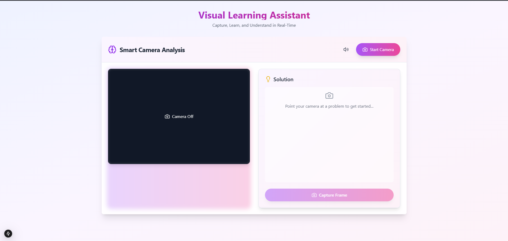

# AI Visual Learning Assistant 🤖 📸



A powerful, real-time learning assistant that uses computer vision and AI to help users understand and solve problems through their camera. This modern web application combines the power of React, Next.js, and machine learning to create an interactive learning experience.

---

## ✨ Features

- **Real-time Camera Processing**: Instantly capture and analyze images through your device's camera.
- **Smart Camera Controls**:
  - Switch between front and rear cameras.
  - Camera state persistence (maintain analyzed content even when the camera is off).
  - Real-time frame capture and processing.
- **Accessibility Features**:
  - Text-to-Speech support for solutions.
  - Mutable audio feedback.
  - High-contrast UI elements.
- **Responsive Design**: Works seamlessly across desktop and mobile devices.
- **Modern UI/UX**:
  - Sleek, gradient-based design.
  - Intuitive controls.
  - Visual feedback for all operations.
  - Loading states and error handling.

- **Image Analysis Endpoint**:
  - Accepts base64-encoded images and processes them.
  - Uses Google Gemini AI for analyzing and generating intelligent solutions.
- **Security**:
  - Validates image data.
  - Ensures minimal latency for API requests.
- **Technology**:
  - Flask with CORS support.
  - Google Generative AI API integration.
  - Optimized for scalability and fast responses.

---

## 🚀 Tech Stack

### **Frontend**

- **Framework**: Next.js 14, React (Latest), TypeScript.
- **Styling**: Tailwind CSS, Lucide Icons, ShadcnUI Components.
- **Features**:
  - WebRTC for camera access.
  - Canvas API for image processing.
  - Web Speech API for text-to-speech.
  - Responsive design principles.
  - Modern gradient aesthetics.

### **Backend**

- **Framework**: Flask.
- **APIs**:
  - Google Generative AI API (Gemini 1.5 Flash).
- **Environment Management**: `python-dotenv`.
- **Image Handling**: PIL (Pillow).
- **Deployment**: Render (or any Python-compatible hosting).

---

## 📋 Prerequisites

Before you begin, ensure you have:

### Frontend

- Node.js 18.x or higher.
- npm or yarn package manager.
- Modern web browser with camera access.

### Backend

- Python 3.8 or higher.
- Google Generative AI API Key.
- Dependencies installed via `requirements.txt`.

---

## 🛠️ Installation

### **Frontend Setup**

1. Clone the repository:

   ```bash
   git clone https://github.com/Adiwanwade/visual-learning-teacher.git
   cd visual-learning-teacher/visual-learning-assistant
   ```

2. Install dependencies:

   ```bash
   npm install
   # or
   yarn install
   ```

3. Set up environment variables:

   ```bash
   cp .env.example .env.local
   ```

   Edit `.env.local` and add your backend API URL:

   ```plaintext
   NEXT_PUBLIC_BACKEND_URL=https://your-backend-url.com
   ```

4. Run the development server:

   ```bash
   npm run dev
   # or
   yarn dev
   ```

5. Open [http://localhost:3000](http://localhost:3000) in your browser.

---

### **Backend Setup**

1. Navigate to the backend folder:

   ```bash
   cd visual-learning-teacher/visual-learning-backend/venv
   ```

2. Create a virtual environment:

   ```bash
   python -m venv venv
   source venv/bin/activate  # For Linux/MacOS
   venv\Scripts\activate     # For Windows
   ```

3. Install dependencies:

   ```bash
   pip install -r requirements.txt
   ```

4. Set up environment variables:
   - Create a `.env` file in the backend directory:

     ```plaintext
     GOOGLE_API_KEY=your_google_generative_ai_api_key
     ```

5. Run the Flask server:

   ```bash
   python app.py
   ```

6. The server will start at [http://localhost:5000](http://localhost:5000).

---

## 💻 Usage

1. Start the camera using the "Start Camera" button and grant permissions.
2. Capture a frame and send it for analysis using the "Capture Frame" button.
3. View the AI-generated solutions and use accessibility features as needed.

---

## 🔒 Privacy & Security

- Camera access is requested only when needed.
- All processing happens in real-time.
- No images are stored permanently.
- Camera permissions can be revoked at any time.

---

## 📝 License

This project is licensed under the MIT License - see the [LICENSE.md](LICENSE.md) file for details.

---

## 📞 Support

For support, email <Adiwanwade@gmail.com> or create an issue in the GitHub repository.

---

Made with ❤️ by Aditya Wanwade.
